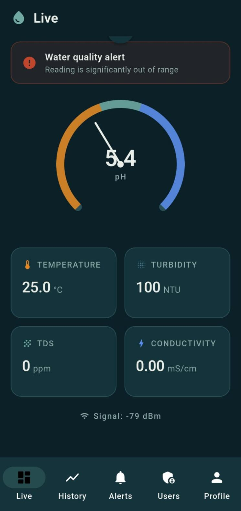
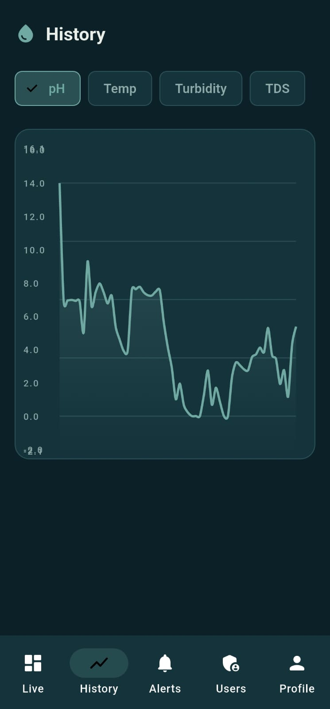
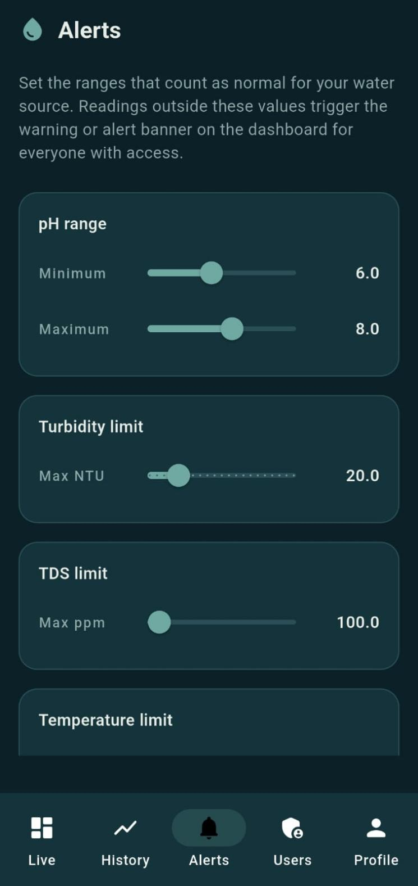
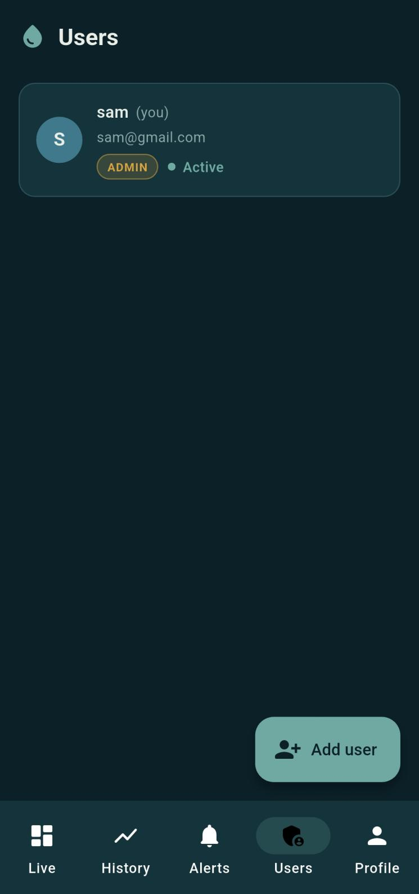
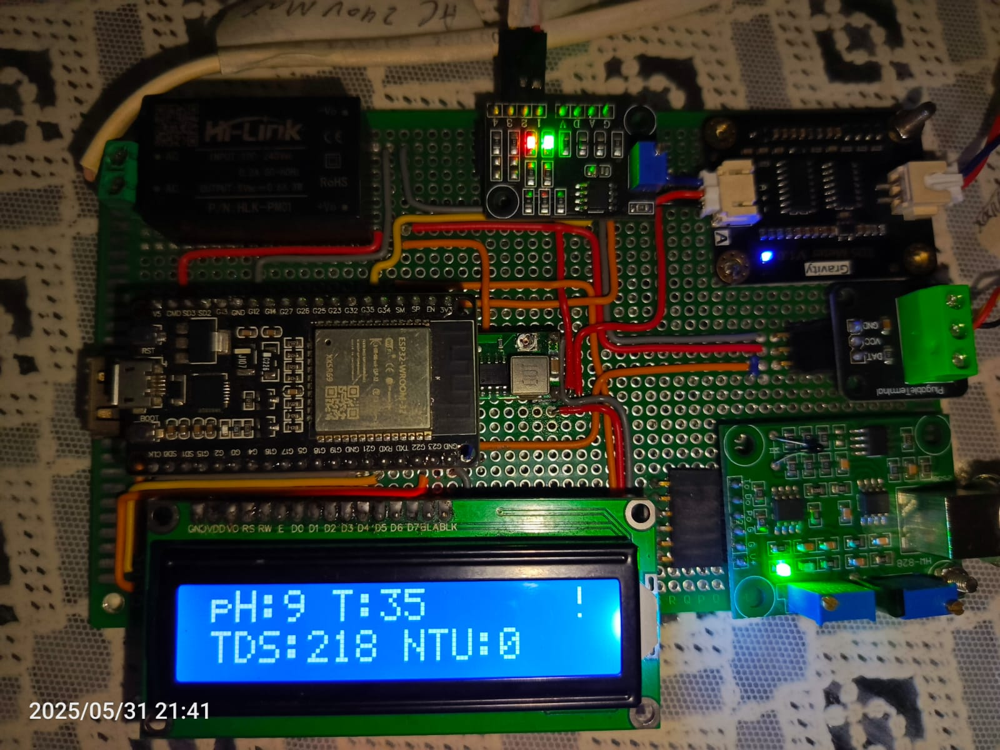

# 💧 Water Quality Monitor

A full-stack IoT system for real-time water quality monitoring. An **ESP32** reads pH, TDS, turbidity, conductivity, and temperature sensors and streams live data to **Firebase Realtime Database**. A **Flutter mobile app** displays live readings, historical trend charts, configurable alerts, and a full **admin-managed access control system** — no public signup, every account is created by an administrator.

---
## 📸 Screenshots

| Live Dashboard | History Charts | Alert Settings |
|---|---|---|
|  |  | |
---
|Admin Panel| 
|---|
| |
---
|---|
|Hardware|

| |

---

## ✨ Features

| Feature | Description |
|---|---|
| **Live Dashboard** | Real-time sensor readings with a custom pH dial gauge |
| **Historical Charts** | Per-metric trend charts from the last 100 readings |
| **Alert Thresholds** | Configurable safe-range limits with status banner (Normal / Warning / Alert) |
| **Admin Access Control** | Admin creates every user account directly — no public signup path |
| **User Management** | Enable, disable, promote, or remove users from inside the app |
| **Offline LCD Display** | Device shows readings locally even without WiFi or internet |
| **Responsive UI** | Bottom navigation on phones, side navigation rail on tablets/desktop |
| **Secure by design** | Firestore + RTDB Security Rules enforce role-based access at the database level |

---

## 🔧 Hardware Components

| Component | Specification |
|---|---|
| Microcontroller | ESP32 Dev Module |
| pH Sensor | Analog pH probe + signal conditioning board |
| TDS / EC Sensor | Analog TDS probe |
| Turbidity Sensor | Analog turbidity sensor |
| Temperature Sensor | DS18B20 waterproof temperature probe (OneWire) |
| Display | 16×2 I2C LCD (address 0x27) |

### Wiring

| Sensor | ESP32 Pin |
|---|---|
| pH probe (analog out) | GPIO 34 |
| TDS probe (analog out) | GPIO 32 |
| Turbidity sensor (analog out) | GPIO 35 |
| DS18B20 data | GPIO 4 |
| LCD SDA | GPIO 21 (default I2C) |
| LCD SCL | GPIO 22 (default I2C) |

---

## 📦 Arduino Libraries Required

Install all of these from **Arduino IDE → Tools → Manage Libraries** before opening the sketch:

| Library | Author | Purpose |
|---|---|---|
| FirebaseClient | Mobizt | Firebase Realtime Database (async) |
| WiFiManager | tzapu | Captive-portal WiFi setup |
| LiquidCrystal_I2C | Frank de Brabander | I2C LCD display |
| OneWire | Jim Studt | DS18B20 communication |
| DallasTemperature | Miles Burton | DS18B20 temperature reading |

> **Important:** Install `FirebaseClient` by **Mobizt** (the newer, actively maintained library). Do **not** install the older `Firebase-ESP-Client` — that library is now deprecated.

---

## ☁️ Part 1 — Firebase Project Setup

All of these steps are done once in the [Firebase Console](https://console.firebase.google.com).

### Step 1 — Create a Firebase Project

1. Go to [console.firebase.google.com](https://console.firebase.google.com) and sign in with a Google account.
2. Click **Add project**, give it a name.
3. Disable Google Analytics if prompted — it is not needed.
4. Wait for provisioning to finish and click **Continue**.

---

### Step 2 — Enable Authentication

1. In the left sidebar: **Build → Authentication → Get started**.
2. Click the **Sign-in method** tab.
3. Click **Email/Password**, toggle it **Enabled**, and save.

---

### Step 3 — Create Firestore Database

1. **Build → Firestore Database → Create database**.
2. Select **Standard edition** (free tier) and click **Next**.
3. On the **Database ID & location** screen:
   - Leave the **Database ID** field exactly as `(default)` — do not type anything else here.
   - Choose a location close to you.
4. Click **Next**, select **Production mode**, then **Create**.

> **Common mistake:** If you type anything into the Database ID field, Firebase treats it as a "named" database and shows a billing upgrade error. Always leave it as `(default)`.

---

### Step 4 — Create Realtime Database

1. **Build → Realtime Database → Create Database**.
2. Choose a location close to you.
3. Start in **Test mode** for now — you will replace the rules in Step 7.
4. Note the **Database URL** shown at the top (e.g. `https://your-project-default-rtdb.asia-southeast1.firebasedatabase.app`). You will need this for the firmware and app.

---

### Step 5 — Get Your Web API Key

1. Click the **gear icon** → **Project settings**.
2. Scroll to **Your apps** → click the **`</>`** (web) icon to register a web app (any nickname).
3. In the `firebaseConfig` block, copy the value of **`apiKey`**. This is your `FIREBASE_API_KEY`.
4. Also copy **`databaseURL`** from this same block for use in the firmware.

---

### Step 6 — Create a Firebase Auth User for the ESP32 Device

The ESP32 signs into Firebase using its own dedicated account.

1. **Authentication → Users → Add user**.
2. Enter a device-specific email (e.g. `esp32@watermonitor.local`) and a strong password.
   - **Use only letters, digits, and simple symbols** (`-`, `_`, `.`, `!`). Avoid `&`, `#`, `$`, `"`, `\` — these can cause silent authentication failures on the ESP32.
3. Save and copy the **User UID** shown for this account.

---

### Step 7 — Apply Security Rules

**Firestore Rules:**
1. **Firestore Database → Rules**.
2. Replace the entire content with the rules from `flutter_app/water_quality_app/firestore_rules.txt`.
3. Click **Publish**.

**Realtime Database Rules:**
1. **Realtime Database → Rules**.
2. Replace the entire content with the JSON from `flutter_app/water_quality_app/firebase_rtdb_rules.json`.
3. Click **Publish**.

---

### Step 8 — Bootstrap Your First Admin (One-Time Manual Step)

This step is done once only — you cannot use the app to create the first admin because no admin exists yet.

#### 8a — Create the admin's Firebase Auth account

1. **Authentication → Users → Add user**.
2. Enter your email and a strong password. This is what you will use to sign into the app as administrator.
3. Copy the **User UID** shown.

#### 8b — Create the admin's Firestore profile

> **Read carefully — this is where most users go wrong.** Firestore has a two-step dialog: first it asks for a **Collection ID**, then a **Document ID**. These must be filled in the correct order.

1. **Firestore Database → Data → Start collection**.
2. **Collection ID** → type exactly: `users` *(all lowercase, this is the collection name)*
3. Click **Next**.
4. **Document ID** → paste your **User UID** from step 8a *(the long alphanumeric string)*
5. Add these fields:

| Field name | Type | Value |
|---|---|---|
| `email` | string | your email address |
| `displayName` | string | your name |
| `role` | string | `admin` |
| `status` | string | `active` |
| `createdAt` | timestamp | now |

6. Click **Save**.

The resulting Firestore path must be `/users/{your-uid}` — verify this by checking the breadcrumb at the top of the Data view.

#### 8c — Grant the admin access to RTDB

1. **Realtime Database → Data**.
2. Hover over the root node and click **+** to add a child named `access`.
3. Under `access`, add a child named with your **User UID**.
4. Under that UID node, add two fields:
   - `granted` → value `true` *(select boolean type, not string)*
   - `role` → value `admin` *(string)*

#### 8d — Grant the ESP32 device access to RTDB

Repeat step 8c for the **ESP32 device's UID** from Step 6, but set `role` to `device` instead of `admin`.

The final `access` structure should look like:
```
access
├── {your-admin-uid}
│   ├── granted: true
│   └── role: "admin"
└── {esp32-device-uid}
    ├── granted: true
    └── role: "device"
```

---

## ⚡ Part 2 — ESP32 Firmware Setup

### Step 9 — Configure Credentials

1. Open the `firmware/Water_Quality_Monitoring/` folder.
2. Copy `secrets.example.h` and rename the copy to `secrets.h` in the same folder.
3. Open `secrets.h` and fill in your real values:

```cpp
#define WIFI_PORTAL_SSID     "Water Quality Monitoring"
#define WIFI_PORTAL_PASSWORD "YourStrongPortalPassword"

#define FIREBASE_API_KEY      "your-web-api-key-from-step-5"
#define FIREBASE_DATABASE_URL "your-rtdb-url-from-step-4"

#define FIREBASE_USER_EMAIL   "esp32@watermonitor.local"
#define FIREBASE_USER_PASS    "your-device-password-from-step-6"
```

> `secrets.h` is listed in `.gitignore` and will never be committed to version control.

### Step 10 — Flash the Firmware

1. Open `Water_Quality_Monitoring.ino` in Arduino IDE.
2. Select board: **Tools → Board → ESP32 Arduino → ESP32 Dev Module**.
3. Select port: **Tools → Port → COMx** (whichever port appears when ESP32 is plugged in).
4. Click **Upload**.

### Step 11 — First Boot WiFi Setup

On first boot, the ESP32 creates its own access point:

1. On your phone or laptop, connect to the WiFi network **"Water Quality Monitoring"** using your portal password.
2. A captive portal opens — select your WiFi network and enter the password.
3. The ESP32 restarts and connects automatically on every subsequent boot.

### Step 12 — Verify Firmware

Open Serial Monitor at **115200 baud**. You should see:

```
WiFi connected
Syncing time...
Time synced.
[Firebase Event] task: authTask, msg: ready, code: 10
[Firebase Debug] task: RTDB_Send_Latest, msg: Connecting to server...
```

Check **Realtime Database → Data** — a `devices/device1/latest` node should appear within 10 seconds with live sensor readings.

---

## 📱 Part 3 — Flutter App Setup

### Prerequisites

| Tool | Download / Install |
|---|---|
| Flutter SDK | [flutter.dev/get-started](https://flutter.dev/get-started) |
| Android Studio | [developer.android.com/studio](https://developer.android.com/studio) |
| Node.js (LTS) | [nodejs.org](https://nodejs.org) |
| Firebase CLI | `npm install -g firebase-tools` |
| FlutterFire CLI | `dart pub global activate flutterfire_cli` |

**Windows users — if `firebase` or `flutterfire` are not recognized after installing:**

Add npm's global bin to PATH:
```powershell
[Environment]::SetEnvironmentVariable("Path", $env:Path + ";$env:APPDATA\npm", "User")
```
Add Dart pub cache to PATH:
```powershell
[Environment]::SetEnvironmentVariable("Path", $env:Path + ";$env:LOCALAPPDATA\Pub\Cache\bin", "User")
```
Close and reopen your terminal after running these commands.

**Windows users — if `npm` itself is not recognized:**
```powershell
Set-ExecutionPolicy -ExecutionPolicy RemoteSigned -Scope CurrentUser
```

---

### Step 13 — Generate Platform Files

The `android/` and `ios/` folders are not included in this repo (they are machine-generated). Generate them locally:

```bash
cd flutter_app/water_quality_app
flutter create .
```

This only generates missing platform scaffolding — it does not overwrite any existing `lib/` source code.

---

### Step 14 — Connect to Firebase

```bash
firebase login
flutterfire configure
```

When prompted:
1. Select your Firebase project.
2. Select **android** as the target platform (and others if needed).
3. `lib/firebase_options.dart` is generated automatically with your real project keys.

> `lib/firebase_options.dart` is gitignored. The template `lib/firebase_options.example.dart` is committed in its place.

---

### Step 15 — Run the App

```bash
flutter pub get
flutter run
```

Sign in with the admin credentials from Step 8a. You should land on the live dashboard showing real sensor readings.

From the **Users** tab, you can now create accounts for any additional users — set their email and a temporary password, share these with them, and they can change their password from the Profile tab after signing in.

---

## 🗂️ Project Structure

```
.
├── firmware/
│   └── Water_Quality_Monitoring/
│       ├── Water_Quality_Monitoring.ino   # Main ESP32 firmware
│       └── secrets.example.h              # Copy to secrets.h, fill in values
│
├── flutter_app/
│   └── water_quality_app/
│       ├── lib/
│       │   ├── main.dart
│       │   ├── firebase_options.example.dart
│       │   ├── models/                    # Data models
│       │   ├── services/                  # Firebase services
│       │   ├── screens/                   # App screens
│       │   ├── widgets/                   # Reusable UI components
│       │   └── theme/                     # Design tokens
│       ├── firestore_rules.txt            # Paste into Firestore Rules
│       └── firebase_rtdb_rules.json       # Paste into RTDB Rules
│
├── .gitignore
├── LICENSE
└── README.md
```

---

## 📊 Data Flow

```
ESP32 sensors (reads every 1s, sends every 10s)
    │
    ├──► 16x2 LCD (always works, even offline)
    │
    └──► Firebase RTDB
            ├── /devices/device1/latest     (live dashboard)
            └── /devices/device1/history    (charts)

Flutter App (live streams, no polling)
    ├── RTDB latest    → Live tab
    ├── RTDB history   → History tab
    ├── RTDB thresholds → Alerts tab
    └── Firestore users → Auth gate + Admin tab
```

---

## 🛠️ Troubleshooting

### Firebase

| Error | Cause | Fix |
|---|---|---|
| "Named database requires billing" when creating Firestore | Database ID field was changed from `(default)` | Go back and leave Database ID as `(default)` |
| App shows "No Access Yet" after correct login | Firestore document path is wrong | Verify `/users/{uid}` exists — Collection ID must be `users`, Document ID must be the UID |
| "No Access Yet" and Firestore path is correct | `role` or `status` field has wrong value or type | Must be string `"admin"` and string `"active"` — not boolean, not capitalized |
| Firestore permission-denied error in app | Security rules not published or wrong | Re-paste `firestore_rules.txt` contents into Firestore Rules and click Publish |

### ESP32 Firmware

| Error | Cause | Fix |
|---|---|---|
| `unauthorized, code: 401` after auth succeeds | Device UID missing from RTDB `access/` node | Add `access/{esp32-uid}` with `granted: true` and `role: "device"` in RTDB |
| Serial Monitor hangs at "Connecting to server..." | TLS handshake timeout too short | Remove any `ssl_client.setHandshakeTimeout()` call from the firmware |
| `NTP sync failed` on every boot | Network blocking UDP port 123 | Switch to a standard home router; avoid captive-portal networks |
| `assert failed: udp_new_ip_type` crash | Known bug in ESP32 core v3.1.0 | Downgrade to ESP32 core v3.0.7 via Arduino IDE Boards Manager |
| Device keeps creating WiFi portal instead of connecting | Saved credentials lost or wrong | Connect to the portal hotspot and re-enter your WiFi credentials |
| `[Firebase Error] msg: unauthorized` with special chars in password | Shell/encoding issue with special characters | Use only letters, digits, `-`, `_`, `.`, `!` in the device Firebase password |

### Flutter App

| Error | Cause | Fix |
|---|---|---|
| `firebase` not recognized | npm global bin not on PATH | Add `$env:APPDATA\npm` to PATH (Windows), reopen terminal |
| `flutterfire` not recognized | Dart pub cache not on PATH | Add `$env:LOCALAPPDATA\Pub\Cache\bin` to PATH (Windows), reopen terminal |
| `npm` not recognized | PowerShell execution policy blocks scripts | Run `Set-ExecutionPolicy -ExecutionPolicy RemoteSigned -Scope CurrentUser` |
| `AndroidManifest.xml not found` | `android/` folder missing | Run `flutter create .` inside `flutter_app/water_quality_app/` |
| `firebase_options.dart not found` | FlutterFire not configured yet | Run `firebase login` then `flutterfire configure` |
| "No supported devices connected" | Phone not detected by ADB | Ensure USB debugging is on, accept the "Allow USB debugging" popup on the phone |
| Build warning "21 packages have newer versions" | Informational only | Safe to ignore — not an error |

---

## 📋 Firebase Free Tier Limits

This project runs entirely within Firebase's free **Spark plan**. No credit card required.

| Service | Free limit | Typical usage |
|---|---|---|
| Authentication | 10,000 sign-ins/month | Negligible |
| Firestore reads | 50,000/day | Negligible (small user list) |
| Realtime Database | 1 GB stored, 10 GB/month downloaded | ~1 reading/10s — tiny fraction |

---

## 📄 License

MIT License — see [LICENSE](LICENSE) for details.

Built by [Sameer Saif](https://github.com/iamsameersaif).
